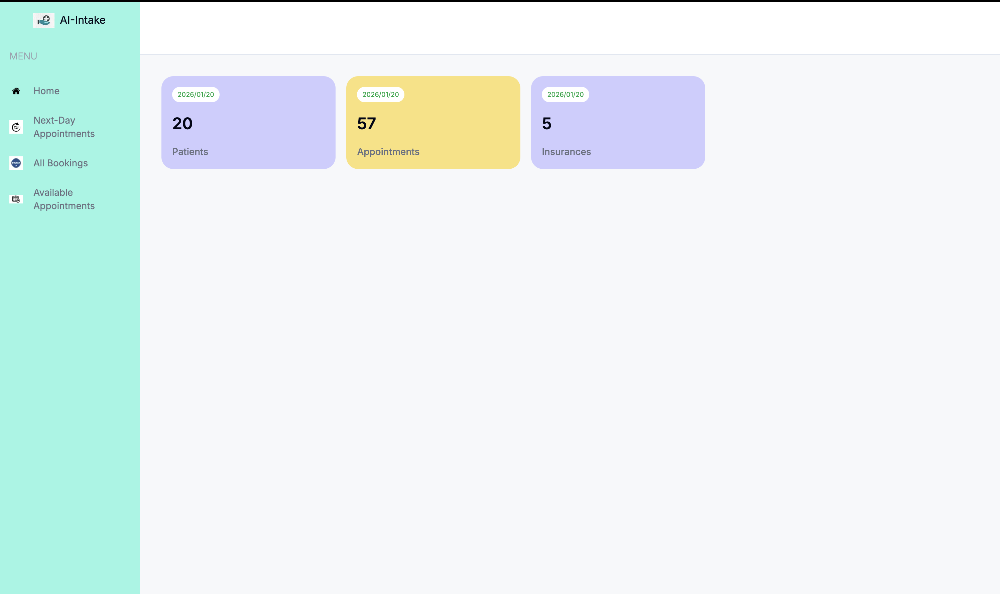

# Intake-First Healthcare Workflow MVP

An MVP demonstrating an intake-first healthcare workflow: a unified next-day intake and eligibility worklist with automated, intake-aware patient reminders designed to reduce clinician administrative burden and improve visit readiness.

---

## Core Workflow

### 1. Unified Next-Day Intake Worklist
- Provides a single view of next-day booked appointments  
- Surfaces **intake readiness** and **insurance eligibility** together  
- Eliminates manual tool switching and cross-checking  
- Reduces staff cognitive load before clinic days  

---

### 2. Intelligent Reminder Triggering
- “Send Reminder” button is enabled only when patient outreach is required  
- Prevents accidental or unnecessary reminders  
- Helps staff focus on patients who need additional follow-up  

---

### 3. Automated Daily Follow-Up

| Schedule         | Action                                                            | Value Delivered                                           |
|------------------|-------------------------------------------------------------------|-----------------------------------------------------------|
| Daily @ 2:00 PM | Identifies next-day booked appointments and sends intake-aware reminders | Automates follow-ups and removes manual patient chasing |

---

### 4. AI-Assisted Communication
- Reminder emails are generated using the **OpenAI API**  
- Designed to support future personalization based on intake or eligibility status  
- Establishes a foundation for AI-assisted clinical workflows  

---

## Tech Stack

| Layer        | Technology                     |
|-------------|--------------------------------|
| Frontend    | Next.js, React.js, HTML, CSS   |
| Backend     | Node.js, NestJS                |
| Database    | In-memory / Mock JSON          |
| Email       | Nodemailer, Mailtrap           |
| AI / LLM    | OpenAI API (email generation)  |
| Scheduling  | Cron Job (daily @ 2 PM)        |

---

## Preview

---

## Live Demo

📺 [Watch the workflow demo](https://drive.google.com/file/d/1UjLqYwJbXgj3JHXABF7VZWeIBqp6_R4G/view?usp=sharing)
